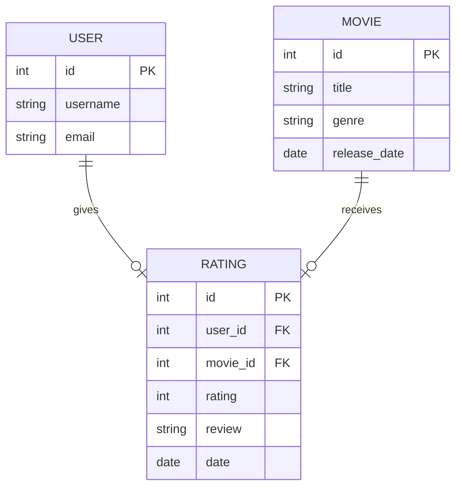

# Data Model
The data model for the movie review system is shown below. The system has three tables: `USER`, `MOVIE`, and `RATING`. The `USER` table stores information about the users of the system. The `MOVIE` table stores information about the movies in the system. The `RATING` table stores information about the ratings and reviews of the movies by the users.

**USER** table has the following columns:
- `id`: Primary key of the user
- `username`: Username of the user
- `email`: Email of the user
  
**MOVIE** table has the following columns:
- `id`: Primary key of the movie
- `title`: Title of the movie
- `genre`: Genre of the movie
- `release_date`: Release date of the movie

**RATING** table has the following columns:
- `id`: Primary key of the rating
- `user_id`: Foreign key to the `USER` table
- `movie_id`: Foreign key to the `MOVIE` table
- `rating`: Rating given by the user (1-5)
- `review`: Review given by the user
- `date`: Date of the rating
  