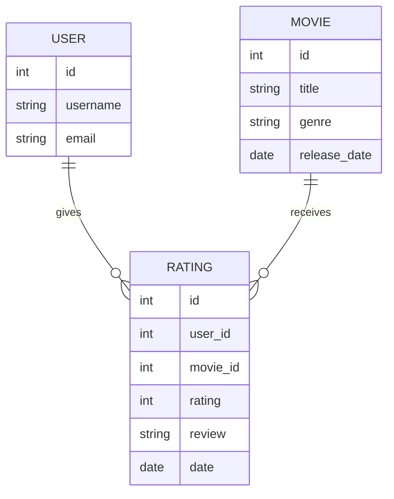

# Data Model
The data model for the movie review system is shown below. The system has three tables: `USER`, `MOVIE`, and `RATING`. The `USER` table stores information about the users of the system. The `MOVIE` table stores information about the movies in the system. The `RATING` table stores information about the ratings and reviews of the movies by the users.

```markdown
